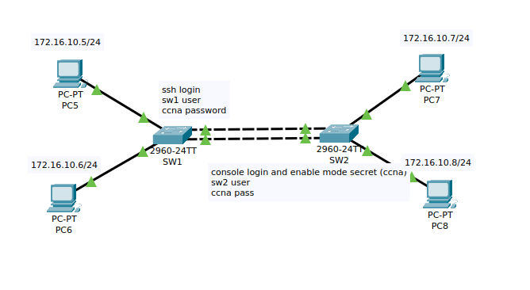

# Lab configuring basic switch configuration

The goal is the get familiar with the different switch modes: user, enable, global config and interface config.

- Configure ssh and enable login on a switch

```bash
(config) interface vlan 1
(int-vlan) ip address 172.20.1.10 255.255.255.0
(int-vlan) no shutdown

(config)line vty 0 15
login local
(config) hostname <SW0>
(config) ip domain-name example.com
(config) crypto key generate rsa
(config) ip ssh version 2

#ssh and console secret 
(config) username sw1 secret ccna

# enable scret
(config) enable secret ccna


(config) line console 0
() login local
```


