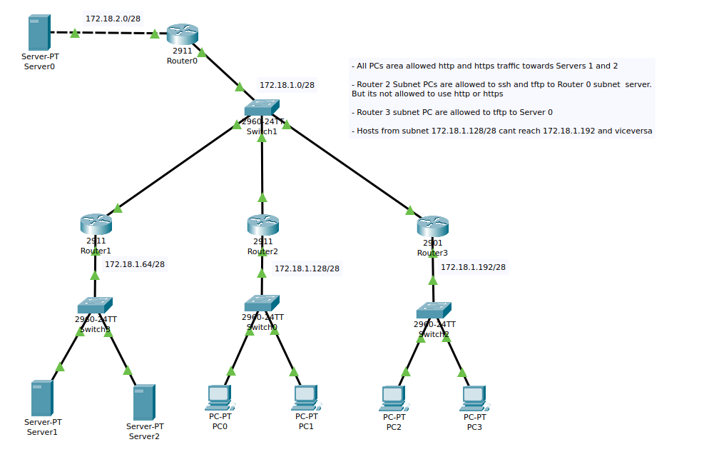

# Access Control Lists and LAN Security



### Standard Access Lists
Permits or Filters traffic based on source IP address.

Sample commands
```bash
#Numbered 1-99, 1300-1999
ip access-list 51 deny 172.18.1.128 0.0.0.15
# Named
ip access-list standard r3-traffic
deny 172.18.1.192 0.0.0.15
```

### Extended Access Lists
Permits or Filters traffic  based on source and/or destination protocol, ports, and IP. 

Sample commands
```bash
# Numbered 100-199, 2000-2699
access-list 101 permit tcp 172.18.1.192 0.0.0.15 172.18.1.64 0.0.0.15 eq 443
# Named 
ip access-list extended r2-traffic
permit tcp 172.18.1.128 0.0.0.15 172.18.1.64 0.0.0.15 eq 80
deny ip any any
```

### DHCP Snooping

Switches can inspect DHCP packets. 

## In this lab 

ACLs configured.

- All PCs area allowed http and https traffic towards Servers 1 and 2 

- Router 2 Subnet PCs are allowed to ssh and tftp to Router 0 subnet  server.
But its not allowed to use http or https

- Router 3 subnet PC are allowed to tftp to Server 0

- Hosts from subnet 172.18.1.128/28 cant reach 172.18.1.192 and viceversa

LAN security in each switch.

- Allow max one source MAC address per interface. If a violation occurs the default action is to restrict.

- Configure dhcp snooping and configure the interfaces connected to the L3 routers as trusted.

- Configure Dynamic ARP inspection (DAI). Interfaces connected to routers as trusted.
